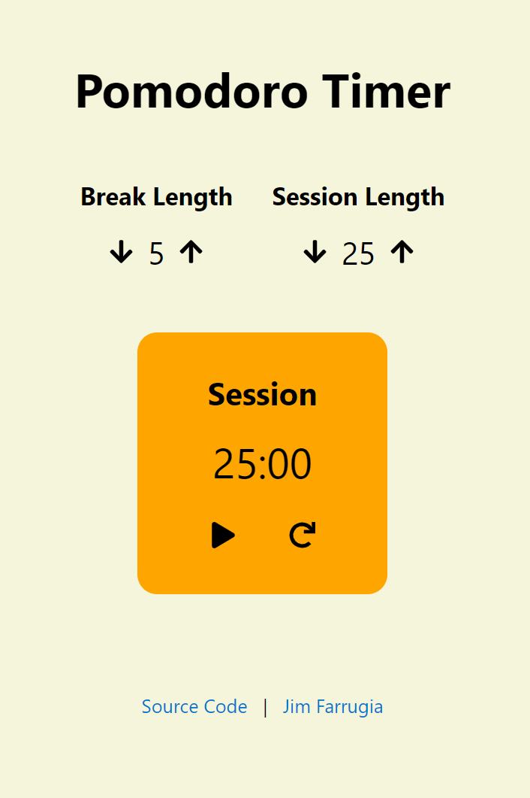

# Pomodoro Timer



## Live Demo

[fcc-react-pomodoro-timer.netlify.app](https://fcc-react-pomodoro-timer.netlify.app/)

## What is a Pomodoro Timer?

> The Pomodoro Technique is a time management method developed by Francesco Cirillo in the late 1980s. The technique uses a timer to break down work into intervals, traditionally 25 minutes in length, separated by short breaks. Each interval is known as a pomodoro, from the Italian word for 'tomato', after the tomato-shaped kitchen timer that Cirillo used as a university student.
>
> The technique has been widely popularized by dozens of apps and websites providing timers and instructions. Closely related to concepts such as timeboxing and iterative and incremental development used in software design, the method has been adopted in pair programming contexts.

Source: [Wikipedia](https://en.wikipedia.org/wiki/Pomodoro_Technique)

## Running the App Locally

### Prerequisites

You will need Node.js which can be downloaded [here](https://nodejs.org/).

### Installation

1. Download or clone this repository.

   ```sh
   git clone https://github.com/Jimfarrugia/react-pomodoro-timer.git
   ```

2. Navigate to the project's root folder and run the following command to install the required NPM packages.

   ```sh
   npm install
   ```

3. Start the development server by running the following command.

   ```sh
   npm run start
   ```

4. If it does not open automatically, open the application in your web browser at the following address:
   ```
   localhost:3000
   ```
